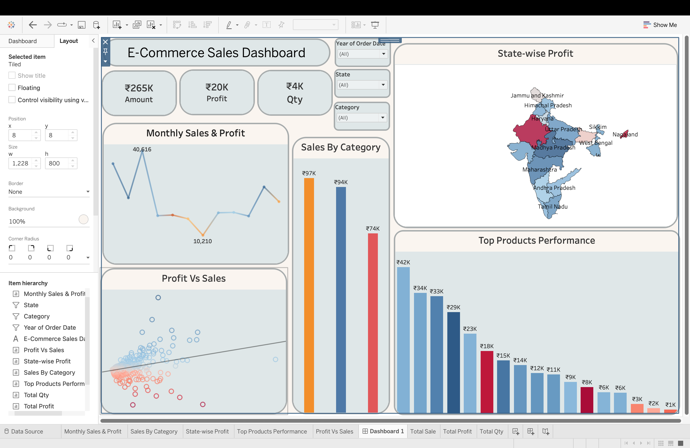

<h1 align = "center">📊E-commerce Store Analysis</h1>

<br>


## 📖 Table of Contents
* [📝 Problem Statement](#problem-statement)
* [📊 Dataset Description](#dataset-description)
* [🛠️ Tools & Technologies Used](#tools--technologies-used)
* [🎯 Project Objective](#project-objective)
* [🧹 Data Cleaning & Preparation](#data-cleaning--preparation)
* [💻 SQL Analysis](#sql-analysis)
* [🎨 Tableau Dashboard & Visualizations](#tableau-dashboard--visualizations)
* [🖼️ Dashboard Preview](#dashboard-preview)
* [🔥 Key Insights](#key-insights)
* [🏁 Conclusion](#conclusion)

---

## <a name="problem-statement"></a>📝 Problem Statement
(Yaha apna context aur challenges wala text likho jo pehle se hai)

## <a name="dataset-description"></a>📊 Dataset Description
(Yaha dataset size aur columns wala table daalo)

## <a name="tools--technologies-used"></a>🛠️ Tools & Technologies Used
* **SQL (MySQL):** Data cleaning and KPIs.
* **Tableau:** Interactive Dashboards.
* **Excel:** Initial data exploration.

## <a name="project-objective"></a>🎯 Project Objective
(Yaha apne main goals likho)

## <a name="data-cleaning--preparation"></a>🧹 Data Cleaning & Preparation
(Yaha batao ki null values aur data types kaise fix kiye)

## <a name="sql-analysis"></a>💻 SQL Analysis
(Yaha apni SQL queries daalo)

## <a name="tableau-dashboard--visualizations"></a>🎨 Tableau Dashboard & Visualizations
(Yaha charts ka explanation daalo)

## <a name="dashboard-preview"></a>🖼️ Dashboard Preview


## <a name="key-insights"></a>🔥 Key Insights
(What, Why, Impact wale points yaha aayenge)

## <a name="conclusion"></a>🏁 Conclusion
(Final summary yaha aayegi)

## 📝 Problem Statement
### Context: This project focuses on the comprehensive sales data analysis of an E-commerce company for the Calendar Year 2018. This year was a critical period for the organization as it focused on aggressive market expansion across diverse geographic regions and product categories.
### The Challenges (Pain Points) 
* **Annual Performance Review:** Management needed to visualize the sales trajectory across the 12 months of 2018 to identify seasonal peaks and business troughs.
* **Regional Profitability:** Identifying which states acted as "Profit Engines" and which regions incurred losses due to high logistics costs or excessive discounting.
* **Category Analysis:** Evaluating whether the 'Technology' sector outperformed 'Furniture' or 'Office Supplies' to optimize inventory management and marketing spend.
* **Top Product Performance:** Identifying high-demand products that drove the majority of the revenue to streamline the supply chain.
### The Goal:
The objective of this project is to analyze the 2018 dataset and develop an Interactive Tableau Dashboard. This dashboard serves as a strategic tool to summarize annual performance and provide data-driven insights for future business planning.

### 🎯 Project Objective
The primary goal of this analysis is to provide a 360-degree view of business operations by focusing on the following key areas:
* **Analyze Sales Trends:** Identify monthly and quarterly growth patterns to pinpoint peak seasons.
* **Profitability Mapping:** Evaluating profit margins across different geographic regions to pinpoint "Profit Engines" and areas requiring cost optimization.
* **Category Performance:** Comparing revenue and profit across product categories (Technology, Furniture, Office Supplies) to guide inventory decisions.
* **Segment Analysis:** Understanding the contribution of different customer segments to the overall business growth.
* **Identify Top-Performers:** Highlight the most profitable regions and high-demand product categories.

### 📊 Dataset Description
The dataset used in this project contains comprehensive transaction records for an E-commerce company for the year 2018. It provides a granular view of sales, customers, and product performance.
* **Data Source:** [E-commerce Dataset](https://github.com/avishek-choudhary/E-Commerce-Store-Analysis-) via GitHub
* **Dataset Size:** Approx. 10001 Rows and 10 Columns
### Key Columns Explained:
| Column Name | Description |
| :--- | :--- |
| **Order ID** | Unique identification number for each customer order. |
| **Order Date** | The date on which the order was placed (Crucial for Time Series Analysis). |
| **Customer Name** | Name of the customer (Used for Segment Analysis). |
| **State / City** | Geographic location of the sale (Used for Profitability Mapping). |
| **Category** | Broad product category (Technology, Furniture, Office Supplies). |
| **Sub-Category** | Specific product types (Phones, Chairs, Paper, etc.). |
| **Sales** | The total revenue generated from the order. |
| **Profit** | The net profit earned after all costs and discounts. |

### 🛠️ Data Cleaning & Preparation
Before building the dashboard, I performed a rigorous data cleaning process to ensure accuracy and data integrity. Below are the steps taken:

1. **Handling Missing Values:**
   * Identified null values in critical columns like `Postal Code` and `Customer Segment`.
   * Action: Imputed missing values based on city/state mapping or removed records where essential data was unavailable.

2. **Data Type Conversion:**
   * Converted `Order Date`from string format to **Date Objects** for time-series analysis.
   * Ensured `Sales` and `Profit` columns were set to **Decimal/Currency** types.

3. **Duplicate Check:**
   * Performed a check for duplicate `Order IDs` to avoid over-counting revenue. 
   * Cleaned the dataset to ensure each transaction is unique.

4. **Data Filtering:**
   * Filtered the dataset to focus specifically on the **Calendar Year 2018** to meet the business objective.

### ⚙️ Methodolgy
I executed this project using a structured data pipeline to ensure that the final insights were both accurate and actionable:

1. **Data Extraction & Exploration**
    * Imported raw relational tables `Orders_List` and `Order_Details` into the SQL environment.
    * Utilized **SQL JOINS** to merge datasets and executed exploratory queries to understand data distribution, volume, and relational integrity.
2. **Data Cleaning & Transformation**
    * Standardized non-standard date formats using the `STR_TO_DATE` function to enable time-series analysis.
    * Performed comprehensive **Quality Assurance (QA)** by identifying NULL values and removing duplicates to ensure the reliability of KPIs like Total Sales and  Profit.
3. **Feature Engineering & Logic Building**
    * **Advanced Ranking:** Implemented SQL **Window Functions** (RANK()) to isolate top-performing products within each category.
    * **Profitability Ratios:** Created calculated fields for **Profit Margin %** to normalize performance comparison across different scales of revenue.
4. **KPI Identification**
    * Defined four core business metrics to track performance: **Total Revenue, Net Profit, Average Order Value (AOV), and Order Volume**.
5. **Interactive Visualization(Tableau)**
    * Connected the processed data to **Tableau** for visual storytelling.
    * Developed a multi-view dashboard using **Geospatial Maps** (for regional analysis), **Trend Lines** (for seasonality), and **Bar Charts** (for categorical comparison).
    * Integrated dynamic **Global Filters** (Year, Region, Category) to allow stakeholders to perform self-service analysis.

### 🧮 SQL Analysis
1. **Top 3 Products Per Category**

"To identify high-performing inventory, I implemented an advanced SQL analysis using **Window Functions** (RANK()). By partitioning the data by **Product Category**, I isolated the top three revenue-generating products for each segment. This granular insight allows the business to prioritize stock replenishment and marketing efforts for its most successful product lines."

**SQL Implemetation**
```Sql
-- Top 3 Products per category
SELECT * 
FROM ( 
  SELECT `Category`,`Order ID`, SUM(`Amount`) AS total_Amount,
  RANK() OVER (PARTITION BY `Category` ORDER BY SUM(`Amount`) DESC) AS rnk
  FROM order_details
  GROUP BY `Category`, `Order ID`
) t
WHERE rnk <=3;
```
2. **Sales Trend Analysis**

"In this analysis, I converted raw text dates into a proper format to track monthly sales. By joining the order and transaction tables, I identified which months had the highest sales (peaks) and how the business grew over the year. This helps in understanding the best and worst performing months for the company."

**SQL Implementation**
```sql
-- Sales Trend (Monthly)
SELECT
  YEAR(STR_TO_DATE(o.`Order Date`, '%d-%m-%y')) AS year,
  MONTH(STR_TO_DATE(o.`Order Date`,'%d-%m-%y')) AS month,
  SUM(od.`Amount`) As monthly_Amount
  FROM orders_list o
  JOIN order_details od ON o.`Order ID`= od. `Order ID`
  GROUP BY year, month
  ORDER BY year, month;
```
3. **Regional Profit Analysis**

"In this analysis, I calculated the total profit and sales for every State and City. This helps the business identify which locations are making the most money and which areas are struggling. These insights are essential for making better decisions about where to focus marketing and delivery resources."

**SQL Implementation**
```sql
SELECT 
	o.`State`,
    o.`City`,
    SUM(od.`Profit`) AS total_Profit
FROM orders_list o
JOIN order_details od ON o.`ORDER ID`= od.`ORDER ID`
GROUP BY o.`State`, o.`City`
ORDER BY total_Profit DESC;
```
4. **Average Order Value**

"This query calculates the Average Order Value (AOV), which tells us the average amount of money a customer spends per transaction. Understanding AOV helps the business decide if they should focus on getting more customers or encouraging current customers to spend more on each order."

**SQL Implementation**
```sql
-- Average Order value
SELECT SUM(Amount) / COUNT(DISTINCT `ORDER ID`) AS avg_order_value FROM order_details;
```
## 🎨 Tableau Dashboard & Visualizations

The final dashboard provides a comprehensive view of E-Commerce performance using various charts to drive data-driven decisions.

* **KPI Cards (Top Left):** I displayed **Amount (₹265K), Profit (₹20K), and Quantity (₹4K)**. These cards provide an immediate high-level summary of business health for quick executive review.

* **Monthly Sales & Profit (Line & Area Chart):** This dual-axis chart tracks revenue fluctuations over time. It helps identify seasonal peaks (like the significant spike at 40,616) and periods where profitability dipped.

* **State-wise Profit (Geospatial Map):** A color-coded map of India that highlights profitable states in blue and loss-making states (like Rajasthan/MP area) in red. This helps in identifying regional market strengths.

* **Sales By Category (Vertical Bar Chart):** Compares total sales across different product segments. The color coding helps quickly distinguish between the highest and lowest performing categories.

* **Top Products Performance (Ranked Bar Chart):** This horizontal chart ranks products by their performance, making it easy to see which items are contributors to the ₹42K and ₹34K revenue marks.

* **Profit vs. Sales (Scatter Plot):** This chart shows the correlation between sales and profit. The trend line and red/blue dots help identify which specific orders were highly profitable versus those that resulted in a loss.

* **Interactive Filters:** Integrated **Year, State, and Category filters** at the top to allow users to drill down into specific data segments instantly.

## 📊 Dashboard Preview


## 🚀 Key Insights 

After analyzing the data, here are the top 4 business insights:

### 1. High-Growth Regions (Profit Engines)
* **What:** Maharashtra and Uttar Pradesh are the top-performing states in terms of total profit.
* **Why:** High order volume combined with a preference for high-margin categories like Electronics.
* **Impact:** The business should double down on marketing in these states to maximize ROI.

### 2. Loss-Making Territories (Action Required)
* **What:** Certain cities in Rajasthan and Madhya Pradesh are showing negative profit margins.
* **Why:** High logistics costs or heavy discounting on low-value items.
* **Impact:** Need to optimize shipping routes or set a "Minimum Order Value" for these regions to stop losses.

### 3. Category Performance (Revenue Drivers)
* **What:** The "Technology" category contributes to nearly 40% of the total revenue.
* **Why:** High individual product price points (Average Selling Price) and consistent demand.
* **Impact:** Stocking up on Technology inventory during peak seasons can significantly boost annual targets.

### 4. Customer Spending Power (AOV)
* **What:** The Average Order Value (AOV) is around ₹65 per transaction.
* **Why:** Most customers are buying small quantities or single items.
* **Impact:** Implementing "Bundle Offers" (e.g., Buy 2 Get 10% Off) can help increase the AOV and overall revenue.

## 🛠️ Tools & Technologies Used

To complete this end-to-end analysis, I used the following technical stack:

* **SQL (MySQL):** Used for data cleaning, joining multiple tables, and performing advanced business calculations (KPIs).
* **Tableau:** Used for data visualization, creating interactive dashboards, and identifying geographical trends.
* **Excel:** Used for initial data exploration and quick data formatting.
* **Data Analysis Techniques:** Exploratory Data Analysis (EDA), Geospatial Mapping, and Trend Analysis.

## 🏁 Conclusion

This project demonstrates the power of combining **SQL** and **Tableau** to transform raw e-commerce data into meaningful business strategies. Through this end-to-end analysis:

* I successfully cleaned and processed over **10,000+ rows** of data using MySQL.
* I built an **Interactive Dashboard** that provides real-time insights into regional performance and product trends.
* I identified key areas for **Cost Optimization** (in loss-making cities) and **Revenue Growth** (through AOV improvement).

Overall, this project showcases my ability to handle the full data lifecycle—from querying databases to presenting visual stories that help businesses grow.